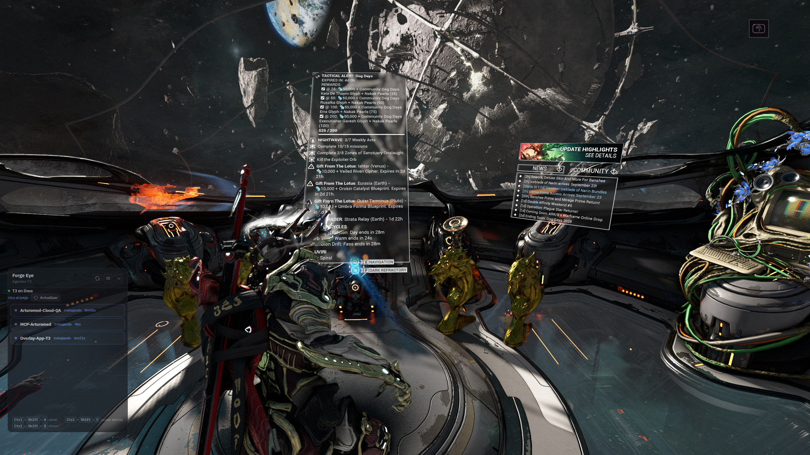
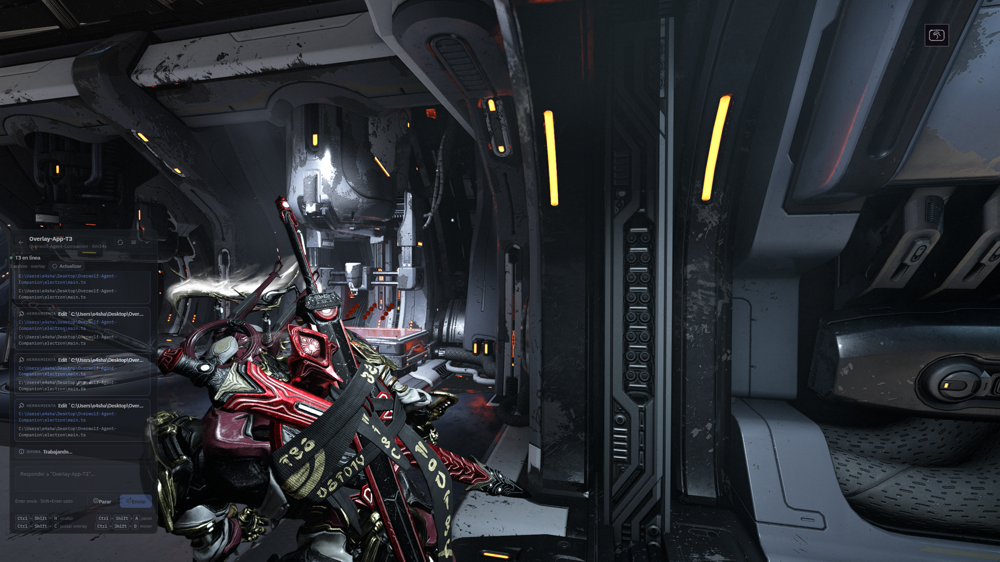

# Forge Eye

Desktop overlay to see and talk to your **T3 Code** agents while you play (for example Warframe in borderless window).

It does not replace T3. It connects to T3 on this same machine, stays on top of the game, and lets you check thread status or send a short message without switching windows.

The app is in **English** by default. You can switch to Spanish in the gear under **Settings**.

## How it looks

Agent list over the game:



Agent chat, with tools and a reply:



## If you do not write code: download the EXE

1. Open [Releases](https://github.com/shaskola/forge-eye/releases).
2. In the latest version download **one** of these files:
   - **ForgeEye-Portable-…exe** — installs nothing. Open it and you are done. Recommended for a first try.
   - **ForgeEye-Setup-…exe** — installer. Adds a Start menu shortcut.
3. Windows may show a SmartScreen warning because the file is not signed yet. Choose **More info** and then **Run anyway**.
4. Keep **T3 Code open** on this same PC. Forge Eye does not work if T3 is not running.
5. In T3: **Settings → Connections → Create Link**. Copy the link.
6. In Forge Eye paste the link and pair once. The session is saved; you do not need to repeat this every time.

The game must be in **borderless window**. Exclusive fullscreen usually covers the overlay.

### Shortcuts

| Action | Keys |
|--------|------|
| Hide / show everything | `Ctrl+Shift+H` |
| Show / hide panel | `Ctrl+Shift+A` |
| Click the overlay (or send clicks back to the game) | `Ctrl+Shift+C` |
| Move mode (drag the window) | `Ctrl+Shift+D` |
| Bring the overlay to the front | `Ctrl+Shift+F` |
| Send message | `Enter` |
| New line in the message | `Shift+Enter` |

Starting position: bottom-left corner. If you move the panel, it stays there — the compact bar uses the same spot.

Opacity is adjusted in the **Settings** gear (it is saved). By default the overlay lets clicks through to the game; `Ctrl+Shift+C` makes it clickable.

### What you will see

- **working** — the agent is on a turn or there is background work.
- **ready** — there is no active work on that thread.
- **error** — T3 reported a failure.

If Forge Eye says “unpaired”, you still need Create Link. If it says “T3 offline”, T3 is not open or is not responding at `http://127.0.0.1:3773`.

## Requirements

- Windows 10 or 11, 64-bit
- [T3 Code](https://t3.chat) installed and open on this machine (port `3773`)
- A pairing link created in T3 (one-time use; if it fails, create another)

## Development (code)

You need Node.js 22 or newer.

```bash
npm install
npm run dev
```

That starts Vite on port **5177** and launches Electron. The window is transparent and always on top. Forge Eye does not embed T3’s UI: it talks to T3 over WebSocket.

Other commands:

```bash
npm run build    # builds dist + dist-electron
npm start        # opens Electron from that build (no hot reload)
npm run dist     # builds the EXEs in the release/ folder
```

The T3 session is saved in `%APPDATA%\forge-eye\t3-session.json`. It does not go into the repository. To unpair, use the option in the app or delete that file.

## Publish a Release with EXEs

Each time you want a downloadable version:

1. Push the code to `main`.
2. Update `"version"` in `package.json` (for example `0.1.1`).
3. Create and push a tag that starts with `v`:

```bash
git tag v0.1.1
git push origin v0.1.1
```

GitHub Actions (**Release** workflow) builds both EXEs on a Windows runner and attaches them to a [GitHub Release](https://github.com/shaskola/forge-eye/releases) with the same tag name.

You can also run the workflow by hand in the **Actions** tab (you still get the artifact, but it only publishes a Release if the run comes from a `v…` tag).

To build the EXEs on your PC, without GitHub:

```bash
npm run dist
```

The files land in `release/ForgeEye-Setup-….exe` and `release/ForgeEye-Portable-….exe`.

## License

[MIT](LICENSE)
